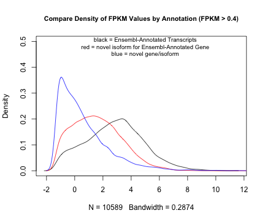
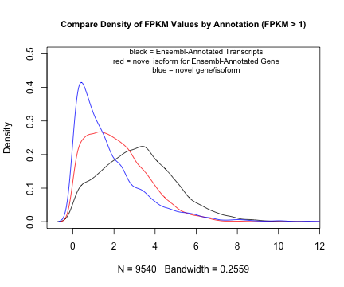

BNLx and SHR Brain polyA+-selected RNA
=========================
* 6 brain polyA+-selected RNA samples, SHR1, SHR2, SHR3, BNLx1, BNLx2, and BNLx3
  * 2X100 paired end reads using the unstranded protocol

1. Unzip raw reads - DONE
-----------------
```
qsub -q smp /home/data/saba/BNLx.SHR.Brain.polyARNA/programs/unzip.yucca.sh
```

2. Consolidate reads by sample and determine number of reads sent for each sample - DONE
-------------------------------------------------
```
qsub -q smp /home/data/saba/BNLx.SHR.Brain.polyARNA/programs/countRawReads.sh
```


Raw Reads/Read Fragments
---------------------------

| sample | Number of Paired-End Reads | Number of Read Fragments |
|:------:|:--------------------------:|:------------------------:|
| BNLx1  |         44,299,616         |        88,599,232        |
| BNLx2  |         16,119,034         |        32,238,068        |
| BNLx3  |         16,801,510         |        33,603,020        |
|  SHR1  |         55,548,038         |       111,096,076        |
|  SHR2  |         29,305,338         |        58,610,676        |
|  SHR3  |         30,404,731         |        60,809,462        |


Total Number of Paired End Reads: 192,478,267  
Total Number of Read Fragments:  384,956,534  
Average Number of Paired End Reads Per Sample: 32,079,711  


3. Trim reads for adaptors and for quality - DONE
---------------
```
qsub -q smp /home/data/saba/BNLx.SHR.Brain.polyARNA/programs/trimReads.yucca.sh
```

4. Count and characterize trimmed reads 
---------------------------------
```
qsub -q smp /home/data/saba/BNLx.SHR.Brain.polyARNA/programs/countTrimmedReads.sh
```


Trimmed Reads/Read Fragments
---------------------------

| sample | Number of Paired-End Reads | Number of Read Fragments | Average Read Fragment Length After Trimming (first read fragment) | Average Read Fragment Length After Trimming (second read fragment) | Number of Read Fragments After Trimming | Percent of Read Fragments That Remained After Trimming |
|:------:|:--------------------------:|:------------------------:|:-----------------------------------------------------------------:|:------------------------------------------------------------------:|:---------------------------------------:|:------------------------------------------------------:|
| BNLx1  |         44,299,616         |        88,599,232        |                               95.2                                |                                95.1                                |                85,970,888               |                         97.0%                          |
| BNLx2  |         16,119,034         |        32,238,068        |                               95.2                                |                                95.2                                |                31,260,898               |                         97.0%                          |
| BNLx3  |         16,801,510         |        33,603,020        |                               95.2                                |                                95.1                                |                32,494,372               |                         96.7%                          |
|  SHR1  |         55,548,038         |       111,096,076        |                               95.1                                |                                95.0                                |               107,682,452               |                         96.9%                          |
|  SHR2  |         29,305,338         |        58,610,676        |                               95.6                                |                                95.6                                |                   5.7e+07               |                         97.3%                          |
|  SHR3  |         30,404,731         |        60,809,462        |                               95.0                                |                                95.0                                |                58,942,104               |                         96.9%                          |


Total Number of Paired End Reads After Trimming: 186,675,269  
Total Number of Read Fragments After Trimming:  373,350,538  
Average Number of Paired End Reads Per Sample After Trimming: 31,112,545  


5.  Align trimmed reads to strain specific genomes including mitochondrial chromosome - DONE
----------------
```
qsub -q smp /home/data/saba/BNLx.SHR.Brain.polyARNA/programs/tophatAlign.01Jul14.sh
```

6. Sort and merge BAM files by strain - DONE
---------------
```
qsub -q smp /home/data/saba/BNLx.SHR.Brain.polyARNA/programs/sortAndMerge.brain.polyA.sh
```


6.  Characterize aligned reads 
------------------------------
Move summary reports to Tabastore3

```
cd /home/data/saba/BNLx.SHR.Brain.polyARNA/alignedReads
get ./BNLx1/align_summary.txt align_summary.BNLx1.txt
get ./BNLx2/align_summary.txt align_summary.BNLx2.txt
get ./BNLx3/align_summary.txt align_summary.BNLx3.txt
get ./SHR1/align_summary.txt align_summary.SHR1.txt
get ./SHR2/align_summary.txt align_summary.SHR2.txt
get ./SHR3/align_summary.txt align_summary.SHR3.txt
```


### Statistics on Alignment to Genome
|                           Label                           | BNLx1 (num) | BNLx1 (pct) | BNLx2 (num) | BNLx2 (pct) | BNLx3 (num) | BNLx3 (pct) | SHR1 (num) | SHR1 (pct) | SHR2 (num) | SHR2 (pct) | SHR3 (num) | SHR3 (pct) |
|:---------------------------------------------------------:|:-----------:|:-----------:|:-----------:|:-----------:|:-----------:|:-----------:|:----------:|:----------:|:----------:|:----------:|:----------:|:----------:|
|                number of paired-end reads                 | 42,985,444  |   100.00%   | 15,630,449  |   100.00%   | 16,247,186  |   100.00%   | 53,841,226 |  100.00%   | 28,499,912 |  100.00%   | 29,471,052 |  100.00%   |
|           number of left reads mapped to genome           | 40,481,476  |   94.17%    | 14,744,521  |   94.33%    | 15,476,004  |   95.25%    | 50,771,471 |   94.30%   | 26,893,642 |   94.36%   | 27,733,894 |   94.11%   |
|          number of right reads mapped to genome           | 40,469,642  |   94.15%    | 14,737,386  |   94.29%    | 15,421,734  |   94.92%    | 50,660,555 |   94.09%   | 26,867,184 |   94.27%   | 27,760,560 |   94.20%   |
|   number of mapped left reads with multiple alignments    |  2,689,232  |    6.26%    |    939,602  |    6.01%    |  1,035,428  |    6.37%    |  3,528,662 |   6.55%    |  1,699,243 |   5.96%    |  1,845,508 |   6.26%    |
|   number of mapped right reads with multiple alignments   |  2,687,856  |    6.25%    |    938,504  |    6.00%    |  1,030,778  |    6.34%    |  3,517,911 |   6.53%    |  1,696,582 |   5.95%    |  1,846,515 |   6.27%    |
| number of mapped left reads with more than 20 alignments  |     50,471  |    0.12%    |     21,760  |    0.14%    |     25,672  |    0.16%    |     69,276 |   0.13%    |     42,352 |   0.15%    |     46,928 |   0.16%    |
| number of mapped right reads with more than 20 alignments |     50,473  |    0.12%    |     21,757  |    0.14%    |     25,670  |    0.16%    |     69,263 |   0.13%    |     42,333 |   0.15%    |     46,933 |   0.16%    |
|                number of mapped read pairs                | 39,083,129  |   90.92%    | 14,251,140  |   91.18%    | 14,968,001  |   92.13%    | 48,801,839 |   90.64%   | 25,888,181 |   90.84%   | 26,765,773 |   90.82%   |
|   number of mapped read pairs with multiple alignments    |  2,575,831  |    5.99%    |    900,410  |    5.76%    |    994,114  |    6.12%    |  3,381,043 |   6.28%    |  1,629,029 |   5.72%    |  1,775,501 |   6.02%    |
|  number of mapped read pairs with discordant alignments   |    693,988  |    1.61%    |    258,450  |    1.65%    |    290,451  |    1.79%    |    888,924 |   1.65%    |    456,550 |   1.60%    |    387,508 |   1.31%    |


**Total Number of Read Fragments Aligned to Genome:** 352,018,069  
**Average Number of Read Fragments Aligned to Genome Per Sample:** 58,669,678  
**Average Rate of Alignment (Read Fragments):** 94.4%  

### Characteristics of Alignments
```
qsub -q smp /home/data/saba/BNLx.SHR.Brain.polyARNA/programs/countByChrom.brain.polyA.sh
```


 


 


7. Generate BigWig Files - DONE
--------------------------
```
qsub -q smp /home/data/saba/BNLx.SHR.Brain.polyARNA/programs/createBigWig.brain.polyA.sh
```

8.  Strain-Specific Transcriptome Reconstruction (Ensembl-Guided) - DONE
--------------------------
```
qsub -q smp /home/data/saba/BNLx.SHR.Brain.polyARNA/programs/reconSHR.brain.polyA.sh
qsub -q smp /home/data/saba/BNLx.SHR.Brain.polyARNA/programs/reconBNLx.brain.polyA.sh
```


