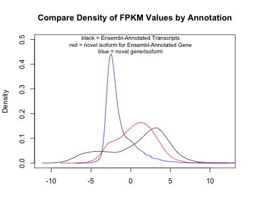
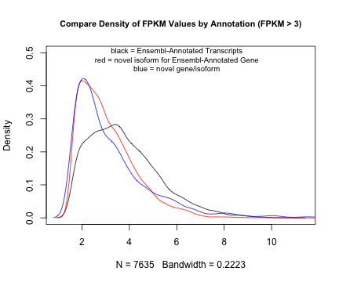
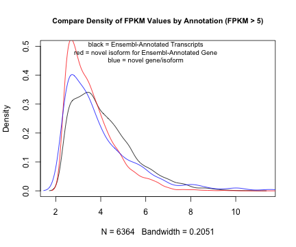

BNLx and SHR Brain Transcriptome Reconstruction
========================================================

PolyA+ Reconstruction
--------------------

The transcriptome reconstruction was done using the Ensembl Database as a guide. Because of this, it is easy to separate transcripts that are novel from transcripts that are already identified in the database.  In the reconstruction CuffLinks also groups transcripts into genes.  If there are multiple transcripts for a gene and some are novel and at least one is annotated in the Ensembl database, then we assume that the novel transcripts are from an annotated gene.  Transcripts identified in the reconstruction were separated into three groups: 1) transcripts that are represented in the Ensembl database, 2) transcripts that are NOT in the Ensembl database themselves but  that belong to a gene that is in the database (i.e., unannotated splice variants of an annotated gene), 3) transcripts that are NOT in the Ensembl database at the transcript or gene level.

### Number of Genes/Transcripts Identified In Reconstruction Based on FPKM Threshold
| FPKM threshold | Number of Genes | Number of Genes With Ensembl Annotation | Percent of Genes With Ensembl Annotation | Number of Transcripts | Number of Transcripts With Ensembl Annotation | Percent of Transcripts with Ensembl Annotation | Number of Novel Transcripts for Annotated Ensembl Genes | Percent of Transcripts That Are a Novel Isoform of an Ensembl Gene | Number of Novel Transcripts/Genes | Percent of Transcripts With NO Ensembl Annotation |
|:--------------:|:---------------:|:---------------------------------------:|:----------------------------------------:|:---------------------:|:---------------------------------------------:|:----------------------------------------------:|:-------------------------------------------------------:|:------------------------------------------------------------------:|:---------------------------------:|:-------------------------------------------------:|
|      0.0       |     43,787      |                 17,029                  |                  38.9%                   |        56,696         |                    14,389                     |                     25.4%                      |                         14,385                          |                               25.4%                                |              27,922               |                       49.2%                       |
|      0.1       |     40,718      |                 14,690                  |                  36.1%                   |        52,502         |                    11,846                     |                     22.6%                      |                         13,710                          |                               26.1%                                |              26,946               |                       51.3%                       |
|      0.4       |     21,797      |                 12,876                  |                  59.1%                   |        30,987         |                    10,589                     |                     34.2%                      |                         11,220                          |                               36.2%                                |               9,178               |                       29.6%                       |
|      0.5       |     20,234      |                 12,583                  |                  62.2%                   |        28,963         |                    10,372                     |                     35.8%                      |                         10,737                          |                               37.1%                                |               7,854               |                       27.1%                       |
|      1.0       |     16,372      |                 11,526                  |                  70.4%                   |        23,405         |                     9,540                     |                     40.8%                      |                          8,917                          |                               38.1%                                |               4,948               |                       21.1%                       |
|      2.0       |     12,915      |                 10,098                  |                  78.2%                   |        17,997         |                     8,440                     |                     46.9%                      |                          6,684                          |                               37.1%                                |               2,873               |                       16.0%                       |
|      3.0       |     11,112      |                  9,083                  |                  81.7%                   |        14,994         |                     7,635                     |                     50.9%                      |                          5,295                          |                               35.3%                                |               2,064               |                       13.8%                       |
|      4.0       |      9,777      |                  8,166                  |                  83.5%                   |        12,896         |                     6,927                     |                     53.7%                      |                          4,337                          |                               33.6%                                |               1,632               |                       12.7%                       |
|      5.0       |      8,782      |                  7,453                  |                  84.9%                   |        11,335         |                     6,364                     |                     56.1%                      |                          3,625                          |                               32.0%                                |               1,346               |                       11.9%                       |

As the FPKM threshold of 'present' is increased, the ratio of annotated to unannotated transcripts and genes increases.  Assuming no annotation basis, it is expected that the ratio of annotated to unannotated transcripts would asymptote as the FPKM threshold increase.  However, there is likely to be an annotation bias.  Genes and transcripts with higher expression levels are easier to detect and study and are therefore more likely to be annotated in the rat genome.

 

 

The purpose of the two plots above was to determine if there was a clear asymptote as FPKM threshold increased. The second graphic is on the gene-level and the line is beginning to asymptote, but the threshold that begins, approximately 2 or 3.  The first graph, which is at the transcript level, is harder to decipher.

### Density of FPKM Values Based on Annotation And FPKM Threshold

 

The plot above is comparing the distribution of FPKM values among transcripts based on their annotation status.  To make the graphics easier to read, the FPKM values were transformed with a log base 2.  Both the black (annotated transcripts) and the red (novel isoforms of annotated genes), indicate a weak bimodal distribution where the first bump may indicate a 'noise' level.  However, the blue (novel genes/isoforms) line has a very different shape with a single strong peak well below an FPKM value of 1 (log2(FPKM)=0).

The graphics below explore the change in shapes of these graphics when a different FPKM threshold for inclusion is used.

 

 

 

 

The last two graphics (FPKM<3 and FPKM<5) show the most similar distribution between the three types of transcripts.  If there were no annotation biases, the true distributions should be similar.

###Identify Possible Background Threshold Using Reads Aligned to Synthetic Spike-Ins NOT Included In These Samples###

To be consistent with the other data sets being analyzed the RNA-Seq reads generated from the polyA+-selected RNA were aligned to a genome that included sequences for 92 synthetic spike-in standards although these spike-ins were not included in the RNA used to generate sequencing libraries.  The synthetic spike-ins were designed so that they did not resemble any sequences in the mammalian genome.  Any expression calculated for these spike-ins is only noise.  FPKM values for these spike-ins were calculated by hand.  Reported below are the standard deviation (times 2) of the FPKM values calculated by strain.  Many values calculated in this manner are used as a detection limit.  However, for this particular example these values are extremely low when compared to the thresholds suggested above.

| data source | Two Standard Deviations of the FPKM Values Across All 92 Spikes | Maximum FPKM Value Across All 92 Spikes |
|:-----------:|:---------------------------------------------------------------:|:---------------------------------------:|
|    BNLx     |                              0.026                              |                  0.076                  |
|     SHR     |                              0.021                              |                  0.048                  |
|  combined   |                              0.020                              |                  0.050                  |

