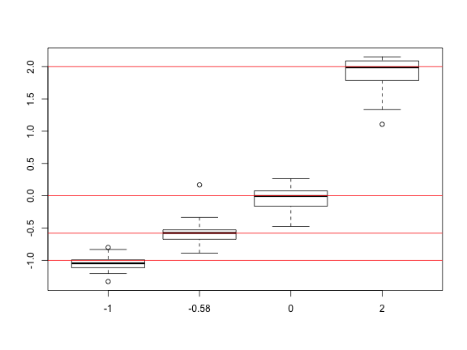

BNLx and SHR Liver rRNA-Depleted Total RNA From UCD Genomics Core
=========================
* 6 liver ribosomal RNA depleted total RNA samples, SHR1, SHR5, SHR25, BNLx1, BNLx2, and BNLx3
* synthetic spikes included
  * Mix 1 in SHR1, BNLx1, and BNLx2 and Mix 2 in SHR5, SHR25, and BNLx3
  * 4 mL of 1:100 diluted spikes were add after RNA extraction but before rRNA-depletion
* 2X100 paired end reads using the stranded protocol
* received 4/1/14


1. Unzip FASTQ files on Yucca - DONE
----------------------------
```
qsub -q smp-q /home/saba/BNLx.SHR.Liver.totalRNA.UCD/programs/unzip.yucca.sh
```

2. Determine number of reads sent for each sample - DONE
----------------------------------------------------------
```
qsub -q smp /home/data/saba/BNLx.SHR.Liver.totalRNA.UCD/programs/countRawReads.liver.sh
```


Raw Reads/Read Fragments
---------------------------

|  sample   | Number of Paired-End Reads | Number of Read Fragments |
|:---------:|:--------------------------:|:------------------------:|
|   BNLx1   |        119,624,256         |       239,248,512        |
|   BNLx2   |        104,944,610         |       209,889,220        |
|   BNLx3   |         69,001,559         |       138,003,118        |
| BNLx3.dup |         86,664,959         |       173,329,918        |
|   SHR1    |        109,987,327         |       219,974,654        |
|   SHR25   |         82,591,985         |       165,183,970        |
| SHR25.dup |        107,292,873         |       214,585,746        |
|   SHR5    |         96,770,957         |       193,541,914        |


Total Number of Paired End Reads: 776,878,526  
Total Number of Read Fragments:  1,553,757,052  
Average Number of Paired End Reads Per Sample: 97,109,816  

3. Trim Reads for Adaptors and for Quality - DONE
--------------------------------------------
```
qsub -q smp /home/data/saba/BNLx.SHR.Liver.totalRNA.UCD/programs/trimReads.yucca.sh
qsub -q smp /home/data/saba/BNLx.SHR.Liver.totalRNA.UCD/programs/trimReads.dups.sh
```

4. Characterizing Trimmed Reads - DONE
----------------------------------
```
qsub -q smp /home/data/saba/BNLx.SHR.Liver.totalRNA.UCD/programs/countTrimmedReads.liver.sh
```


Trimmed Reads/Read Fragments
---------------------------

|  sample   | Number of Paired-End Reads | Number of Read Fragments | Average Read Fragment Length After Trimming (first read fragment) | Average Read Fragment Length After Trimming (second read fragment) | Number of Read Fragments After Trimming | Percent of Read Fragments That Remained After Trimming |
|:---------:|:--------------------------:|:------------------------:|:-----------------------------------------------------------------:|:------------------------------------------------------------------:|:---------------------------------------:|:------------------------------------------------------:|
|   BNLx1   |        119,624,256         |       239,248,512        |                               94.2                                |                                91.4                                |               234,327,370               |                         97.9%                          |
|   BNLx2   |        104,944,610         |       209,889,220        |                               96.6                                |                                95.6                                |               207,427,684               |                         98.8%                          |
|   BNLx3   |         69,001,559         |       138,003,118        |                               84.7                                |                                97.2                                |               137,036,336               |                         99.3%                          |
| BNLx3.dup |         86,664,959         |       173,329,918        |                               99.1                                |                                88.5                                |               172,398,826               |                         99.5%                          |
|   SHR1    |        109,987,327         |       219,974,654        |                               97.8                                |                                96.7                                |               217,663,066               |                         98.9%                          |
|   SHR25   |         82,591,985         |       165,183,970        |                               84.2                                |                                96.9                                |               163,641,336               |                         99.1%                          |
| SHR25.dup |        107,292,873         |       214,585,746        |                               99.2                                |                                88.2                                |               213,344,618               |                         99.4%                          |
|   SHR5    |         96,770,957         |       193,541,914        |                               96.5                                |                                95.3                                |               190,584,770               |                         98.5%                          |


Total Number of Paired End Reads After Trimming: 768,212,003  
Total Number of Read Fragments After Trimming:  1,536,424,006  
Average Number of Paired End Reads Per Sample After Trimming: 96,026,500  


5.  Generate Strain-Specific Genomes Including Spike-In Sequences - DONE
-------------------------------------------
```
qsub -q smp-q /home/saba/BNLx.SHR.Liver.totalRNA.UCD/programs/createGenomeIndex.yucca.sh
```

6. Align trimmed reads to ribosomal RNA - DONE
-----------------------------------
```
qsub -q smp /home/data/saba/BNLx.SHR.Liver.totalRNA.UCD/programs/alignTo.rRNA.liver.01Jul14.sh
qsub -q smp /home/data/saba/BNLx.SHR.Liver.totalRNA.UCD/programs/alignTo.rRNA.liver.dups.10Jul14.sh
```

**move files**
```
get BNLx1.rRNA/align_summary.txt rRNA.summary.BNLx1.txt  
get BNLx2.rRNA/align_summary.txt rRNA.summary.BNLx2.txt  
get BNLx3.rRNA/align_summary.txt rRNA.summary.BNLx3.txt  
get SHR1.rRNA/align_summary.txt rRNA.summary.SHR1.txt  
get SHR25.rRNA/align_summary.txt rRNA.summary.SHR25.txt  
get SHR5.rRNA/align_summary.txt rRNA.summary.SHR5.txt  
get SHR25.dup.rRNA/align_summary.txt rRNA.summary.SHR25.dup.txt  
get BNLx3.dup.rRNA/align_summary.txt rRNA.summary.BNLx3.dup.txt  
```


|  Sample   | Number of Paired-End Reads After Trimming | Number of Paired-End Reads with at Least One Fragment Aligned to rRNA | Percent of Paired-End Reads Aligned to rRNA | Number of Paired-End Reads NOT Aligned to rRNA |
|:---------:|:-----------------------------------------:|:---------------------------------------------------------------------:|:-------------------------------------------:|:----------------------------------------------:|
|   BNLx1   |                117,163,685                |                              27,582,382                               |                    23.5%                    |                   89,581,303                   |
|   BNLx2   |                103,713,842                |                              22,154,258                               |                    21.4%                    |                   81,559,584                   |
|   BNLx3   |                 68,518,168                |                               4,224,768                               |                    6.2%                     |                   64,293,400                   |
| BNLx3.dup |                 86,199,413                |                               5,695,336                               |                    6.6%                     |                   80,504,077                   |
|   SHR1    |                108,831,533                |                               6,658,641                               |                    6.1%                     |                  102,172,892                   |
|   SHR25   |                 81,820,668                |                               7,966,721                               |                    9.7%                     |                   73,853,947                   |
| SHR25.dup |                106,672,309                |                              11,755,852                               |                    11.0%                    |                   94,916,457                   |
|   SHR5    |                 95,292,385                |                               6,749,851                               |                    7.1%                     |                   88,542,534                   |


Total Number of Paired End Reads After Eliminating rRNA Aligned Reads: 675,424,194  
Average Number of Paired End Reads Per Sample After Eliminating rRNA Aligned Reads: 84,428,024  


7. Convert unmapped.bam into fastq files  - DONE
----------------------------------------
```
qsub -q smp /home/data/saba/BNLx.SHR.Liver.totalRNA.UCD/programs/convertToFastQ.liver.sh
```

8. Alignment of Raw Reads to Strain-Specific Genomes With Mitochondrial Chromosome - DONE
------------------------------------

```
qsub -q smp /home/data/saba/BNLx.SHR.Liver.totalRNA.UCD/programs/tophatAlign.liver.sh
qsub -q smp /home/data/saba/BNLx.SHR.Liver.totalRNA.UCD/programs/tophatAlign.liver.v2.sh
```

9.  Sort and Merge Aligned Reads By Strain - DONE
--------------------------

```
qsub -q smp /home/data/saba/BNLx.SHR.Liver.totalRNA.UCD/programs/sortAndMerge.liver.BNLx.sh
qsub -q smp /home/data/saba/BNLx.SHR.Liver.totalRNA.UCD/programs/sortAndMerge.liver.SHR.sh
```

10.  Characterization of Aligned Reads
---------------------------


**move files**
```
cd /home/data/saba/BNLx.SHR.Liver.totalRNA.UCD/alignedReads
get ./BNLx1/align_summary.txt align_summary.BNLx1.txt
get ./BNLx2/align_summary.txt align_summary.BNLx2.txt
get ./BNLx3/align_summary.txt align_summary.BNLx3.txt
get ./SHR1/align_summary.txt align_summary.SHR1.txt
get ./SHR5/align_summary.txt align_summary.SHR5.txt
get ./SHR25/align_summary.txt align_summary.SHR25.txt
get ./SHR25.dup/align_summary.txt align_summary.SHR25.dup.txt
get ./BNLx3.dup/align_summary.txt align_summary.BNLx3.dup.txt
```


### Statistics on Alignment to Genome
|                           Label                           | BNLx1 (num) | BNLx1 (pct) | BNLx2 (num) | BNLx2 (pct) | BNLx3 (num) | BNLx3 (pct) | BNLx3.dup (num) | BNLx3.dup (pct) | SHR1 (num)  | SHR1 (pct) | SHR5 (num)  | SHR5 (pct) | SHR25 (num) | SHR25 (pct) | SHR25.dup (num) | SHR25.dup (pct) |
|:---------------------------------------------------------:|:-----------:|:-----------:|:-----------:|:-----------:|:-----------:|:-----------:|:---------------:|:---------------:|:-----------:|:----------:|:-----------:|:----------:|:-----------:|:-----------:|:---------------:|:---------------:|
|                number of paired-end reads                 |  89,581,303 |   100.00%   |  81,559,584 |   100.00%   |  64,293,400 |   100.00%   |    80,504,077   |     100.00%     | 102,172,892 |  100.00%   |  88,542,534 |  100.00%   |  73,853,947 |   100.00%   |    94,916,457   |     100.00%     |
|           number of left reads mapped to genome           |  79,424,860 |   88.66%    |  75,464,766 |   92.53%    |  59,536,438 |   92.60%    |    76,636,303   |     95.20%      |  93,912,132 |   91.91%   |  81,894,860 |   92.49%   |  68,266,398 |   92.43%    |    90,453,308   |     95.30%      |
|          number of right reads mapped to genome           |  82,470,084 |   92.06%    |  75,744,103 |   92.87%    |  61,296,626 |   95.34%    |    74,396,838   |     92.41%      |  94,507,388 |   92.50%   |  82,779,498 |   93.49%   |  70,388,899 |   95.31%    |    87,861,407   |     92.57%      |
|   number of mapped left reads with multiple alignments    |  21,453,414 |   23.95%    |   9,793,583 |   12.01%    |   6,736,344 |   10.48%    |     9,015,931   |     11.20%      |  12,491,493 |   12.23%   |   9,916,128 |   11.20%   |  12,786,126 |   17.31%    |    17,031,344   |     17.94%      |
|   number of mapped right reads with multiple alignments   |  21,932,101 |   24.48%    |   9,849,294 |   12.08%    |   6,844,056 |   10.65%    |     8,895,978   |     11.05%      |  12,575,802 |   12.31%   |  10,072,463 |   11.38%   |  12,999,744 |   17.60%    |    16,913,170   |     17.82%      |
| number of mapped left reads with more than 20 alignments  |     588,712 |    0.66%    |     320,547 |    0.39%    |     394,573 |    0.61%    |       460,768   |      0.57%      |     274,406 |   0.27%    |     409,817 |   0.46%    |     264,148 |    0.36%    |       276,266   |      0.29%      |
| number of mapped right reads with more than 20 alignments |     591,076 |    0.66%    |     328,720 |    0.40%    |     398,510 |    0.62%    |       462,065   |      0.57%      |     274,884 |   0.27%    |     413,396 |   0.47%    |     267,422 |    0.36%    |       276,841   |      0.29%      |
|                number of mapped read pairs                |  73,118,818 |   81.62%    |  73,754,698 |   90.43%    |  58,007,028 |   90.22%    |    72,575,666   |     90.15%      |  91,195,449 |   89.26%   |  79,621,775 |   89.92%   |  66,331,136 |   89.81%    |    85,551,941   |     90.13%      |
|   number of mapped read pairs with multiple alignments    |  20,501,349 |   22.89%    |   9,454,978 |   11.59%    |   6,394,778 |    9.95%    |     8,470,535   |     10.52%      |  12,022,181 |   11.77%   |   9,568,255 |   10.81%   |  12,406,873 |   16.80%    |    16,421,465   |     17.30%      |
|  number of mapped read pairs with discordant alignments   |  70,552,297 |   78.76%    |     932,282 |    1.14%    |   1,033,521 |    1.61%    |     1,266,860   |      1.57%      |   1,198,854 |   1.17%    |   1,563,318 |   1.77%    |     912,575 |    1.24%    |     1,099,861   |      1.16%      |

**Total Number of Aligned Paired End Reads:** 600,156,511    
**Total Number of Aligned Read Fragments:** 1,255,033,908  
**Average Number of Aligned Read Fragments Per Sample:** 156,879,238  
**Average Rate of Alignment (Read Fragments):** 93.0%  

### Characteristics of Alignments
```
qsub -q smp /home/data/saba/BNLx.SHR.Liver.totalRNA.UCD/programs/countByChrom.liver.sh
```


 


 


### Synthetic spike-in summary
|  Sample   | Num of Read Fragments | Num of rRNA Aligned Read Fragments | Num of Genome-Aligned Read Fragments | Num of Read Fragments Aligned to Spikes | Percent of Genome-Aligned Read Fragments Aligned to Spikes | Percent of All Read Fragments Aligned to Spikes |
|:---------:|:---------------------:|:----------------------------------:|:------------------------------------:|:---------------------------------------:|:----------------------------------------------------------:|:-----------------------------------------------:|
|   BNLx1   |      234,327,370      |             55,164,764             |             161,894,944              |                5,395,717                |                           3.33%                            |                      2.30%                      |
|   BNLx2   |      207,427,684      |             44,308,516             |             151,208,869              |                2,849,944                |                           1.88%                            |                      1.37%                      |
|   BNLx3   |      137,036,336      |              8,449,536             |             120,833,064              |                1,435,548                |                           1.19%                            |                      1.05%                      |
| BNLx3.dup |      217,663,066      |             13,317,282             |             151,033,141              |                1,818,591                |                           1.20%                            |                      0.84%                      |
|   SHR1    |      163,641,336      |             15,933,442             |             188,419,520              |                5,463,716                |                           2.90%                            |                      3.34%                      |
|   SHR25   |      190,584,770      |             13,499,702             |             164,674,358              |                3,111,367                |                           1.89%                            |                      1.63%                      |
| SHR25.dup |      172,398,826      |             11,390,672             |             138,655,297              |                9,547,563                |                           6.89%                            |                      5.54%                      |
|   SHR5    |      213,344,618      |             23,511,704             |             178,314,715              |               12,123,357                |                           6.80%                            |                      5.68%                      |


10.  Examine Spike-In Expression - HAVEN'T RUN FOR DATA WITH MITO
-----------------------

```
qsub -q smp-q /home/saba/BNLx.SHR.Liver.totalRNA.UCD/programs/quantifyControlSpikes.21Apr14.sh
```


### Synthetic spike-in summary


### Comparison of raw read count versus spike concentrations


Each color represents a different sample.  The y-axis of the plot on the left represents the log base 2 of the read count for each spike plus 1. The y-axis of the plot in the middle represents the "voom" expression values when the library size is calculated as ALL mapped reads. The y-axis of the plot on the right represents the "voom" expression values when the library size is calculated as only the reads that map to a synthetic spike-in.  

### Expected Differential Expression In Spikes Between Mixes


Red lines represent the expected log 2 fold differences.  Only spikes that were included in a concentration greater than 0.5 in both samples were included in figure (66 out of 92 spikes).


12.  Strain-Specific Transcriptome Reconstruction (Ensembl-Guided)
--------------------------

```
qsub -q smp /home/data/saba/BNLx.SHR.Liver.totalRNA.UCD/programs/reconSHR.liver.sh
qsub -q smp /home/data/saba/BNLx.SHR.Liver.totalRNA.UCD/programs/reconBNLx.liver.sh
```

13.  Create BigWig Files
-------------------
```
qsub -q smp /home/saba/BNLx.SHR.Liver.totalRNA.UCD/programs/testBigWig.sh
```

