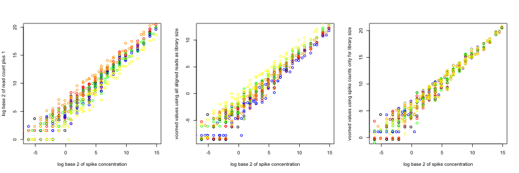

Initial Quality Control of Liver RNA-Seq Reads From UCD Genomics Core (received 4/1/14)
=========================
* 6 liver ribosomal RNA depleted total RNA samples, SHR1, SHR5, SHR25, BNLx1, BNLx2, and BNLx3
* synthetic spikes included Mix 1 in SHR1, BNLx1, and BNLx2 and Mix 2 in SHR5, SHR25, and BNLx3
* 2X100 paired end reads using the stranded protocol


1. Unzip FASTQ files on Yucca - DONE
----------------------------
```
qsub -q smp-q /home/saba/BNLx.SHR.Liver.totalRNA.UCD/programs/unzip.yucca.sh
```

2. Determine number of reads sent for each sample - DONE
----------------------------------------------------------
```
qsub -q smp-q /home/saba/BNLx.SHR.Liver.totalRNA.UCD/programs/rawReadCounts.sh
```


Raw Reads/Read Fragments From UCD Genomic Core
---------------------------

| sample | strain | lane | numPairedReads | numReadFragments |
|:------:|:------:|:----:|:--------------:|:----------------:|
| BNLx1  |  BNLx  | L005 |  119,624,256   |   239,248,512    |
| SHRH1  |  SHR   | L005 |  109,987,327   |   219,974,654    |
| BNLx2  |  BNLx  | L006 |  104,944,610   |   209,889,220    |
| SHRH5  |  SHR   | L006 |   96,770,957   |   193,541,914    |
| BNLx3  |  BNLx  | L007 |   69,001,559   |   138,003,118    |
| SHRL25 |  SHR   | L007 |   82,591,985   |   165,183,970    |


3. Trim Reads for Adaptors and for Quality - DONE
--------------------------------------------
```
qsub -q smp-q /home/saba/BNLx.SHR.Liver.totalRNA.UCD/programs/trimReads.yucca.sh
```

4. Characterizing Trimmed Reads - DONE
----------------------------------
```
qsub -q smp-q /home/saba/BNLx.SHR.Liver.totalRNA.UCD/programs/countTrimmed.yucca.sh
```


Effect of Trimming Adaptors and Poor Quality Base Calls
---------------------------

| sample | strain | lane | numPairedReads | numReadFragments | avgTrimmedReadLength | numTrimmedReadFragments | pctRemovedByTrimming |
|:------:|:------:|:----:|:--------------:|:----------------:|:--------------------:|:-----------------------:|:--------------------:|
| BNLx1  |  BNLx  | L005 |  119,624,256   |   239,248,512    |        92.83         |       234,327,370       |        0.021%        |
| BNLx2  |  BNLx  | L006 |  104,944,610   |   209,889,220    |        96.09         |       207,427,684       |        0.012%        |
| BNLx3  |  BNLx  | L007 |   69,001,559   |   138,003,118    |        90.95         |       137,036,336       |        0.007%        |
| SHRH1  |  SHR   | L005 |  109,987,327   |   219,974,654    |        97.27         |       217,663,066       |        0.011%        |
| SHRH5  |  SHR   | L006 |   96,770,957   |   193,541,914    |        95.94         |       190,584,770       |        0.015%        |
| SHRL25 |  SHR   | L007 |   82,591,985   |   165,183,970    |        90.56         |       163,641,336       |       0.0093%        |


5.  Generate Strain-Specific Genomes Including Spike-In Sequences - DONE
-------------------------------------------
```
qsub -q smp-q /home/saba/BNLx.SHR.Liver.totalRNA.UCD/programs/createGenomeIndex.yucca.sh
```

6. Alignment of Raw Reads to Strain-Specific Genomes - DONE
------------------------------------

```
qsub -q smp-q /home/saba/BNLx.SHR.Liver.totalRNA.UCD/programs/tophatAlign.15Apr14.sh
```

### Code from tophatAlign.15Apr14.sh
```
#!/bin/bash
module add bio/bowtie2
module add bio/tophat
tophat2 --library-type fr-firststrand -o /home/saba/BNLx.SHR.Liver.totalRNA.UCD/alignedReads/SHR1 -p 16 /home/saba/index/SHR_rn5_wSpikes /home/saba/BNLx.SHR.Liver.totalRNA.UCD/trimmedReads/SHR_H1_CGATGT_L005_R1_001_val_1.fq /home/saba/BNLx.SHR.Liver.totalRNA.UCD/trimmedReads/SHR_H1_CGATGT_L005_R2_001_val_2.fq
tophat2 --library-type fr-firststrand -o /home/saba/BNLx.SHR.Liver.totalRNA.UCD/alignedReads/SHR5 -p 16 /home/saba/index/SHR_rn5_wSpikes /home/saba/BNLx.SHR.Liver.totalRNA.UCD/trimmedReads/SHR_H5_TGACCA_L006_R1_001_val_1.fq /home/saba/BNLx.SHR.Liver.totalRNA.UCD/trimmedReads/SHR_H5_TGACCA_L006_R2_001_val_2.fq
tophat2 --library-type fr-firststrand -o /home/saba/BNLx.SHR.Liver.totalRNA.UCD/alignedReads/SHR25 -p 16 /home/saba/index/SHR_rn5_wSpikes /home/saba/BNLx.SHR.Liver.totalRNA.UCD/trimmedReads/SHR_L25_ACAGTG_L007_R1_001_val_1.fq /home/saba/BNLx.SHR.Liver.totalRNA.UCD/trimmedReads/SHR_L25_ACAGTG_L007_R2_001_val_2.fq
tophat2 --library-type fr-firststrand -o /home/saba/BNLx.SHR.Liver.totalRNA.UCD/alignedReads/BNLx1 -p 16 /home/saba/index/BNLx_rn5_wSpikes /home/saba/BNLx.SHR.Liver.totalRNA.UCD/trimmedReads/BNLX_1_GCCAAT_L005_R1_001_val_1.fq /home/saba/BNLx.SHR.Liver.totalRNA.UCD/trimmedReads/BNLX_1_GCCAAT_L005_R2_001_val_2.fq
tophat2 --library-type fr-firststrand -o /home/saba/BNLx.SHR.Liver.totalRNA.UCD/alignedReads/BNLx2 -p 16 /home/saba/index/BNLx_rn5_wSpikes /home/saba/BNLx.SHR.Liver.totalRNA.UCD/trimmedReads/BNLX_2_CAGATC_L006_R1_001_val_1.fq /home/saba/BNLx.SHR.Liver.totalRNA.UCD/trimmedReads/BNLX_2_CAGATC_L006_R2_001_val_2.fq
tophat2 --library-type fr-firststrand -o /home/saba/BNLx.SHR.Liver.totalRNA.UCD/alignedReads/BNLx3 -p 16 /home/saba/index/BNLx_rn5_wSpikes /home/saba/BNLx.SHR.Liver.totalRNA.UCD/trimmedReads/BNLX_3_CTTGTA_L007_R1_001_val_1.fq /home/saba/BNLx.SHR.Liver.totalRNA.UCD/trimmedReads/BNLX_3_CTTGTA_L007_R2_001_val_2.fq
```

7.  Characterization of Aligned Reads
---------------------------


```
## Error: undefined columns selected
```


### Statistics on Alignment to Genome
|     var      | orderNum |                           Label                           |    BNLx1    |    BNLx2    |    BNLx3    |    SHR1     |    SHR5     |    SHR25    | BNLx1.pct | BNLx2.pct | BNLx3.pct | SHR1.pct | SHR5.pct | SHR25.pct |
|:------------:|:--------:|:---------------------------------------------------------:|:-----------:|:-----------:|:-----------:|:-----------:|:-----------:|:-----------:|:---------:|:---------:|:---------:|:--------:|:--------:|:---------:|
|   numReads   |     1    |                number of paired-end reads                 | 117,163,685 | 103,713,842 |  68,518,168 | 108,831,533 |  95,292,385 |  81,820,668 |  100.00%  |  100.00%  |  100.00%  | 100.00%  | 100.00%  |  100.00%  |
|  mappedLeft  |     2    |           number of left reads mapped to genome           |  93,469,369 |  85,894,081 |  55,948,593 |  87,079,069 |  78,937,330 |  66,505,163 |  79.78%   |  82.82%   |  81.66%   |  80.01%  |  82.84%  |  81.28%   |
| mappedRight  |     3    |          number of right reads mapped to genome           |  97,659,430 |  86,640,055 |  57,594,808 |  87,728,886 |  79,841,117 |  68,322,575 |  83.35%   |  83.54%   |  84.06%   |  80.61%  |  83.79%  |  83.50%   |
|  multiLeft   |     4    |   number of mapped left reads with multiple alignments    |  29,383,687 |  25,237,328 |   9,619,769 |  16,517,465 |  14,618,323 |  19,262,569 |  25.08%   |  24.33%   |  14.04%   |  15.18%  |  15.34%  |  23.54%   |
|  multiRight  |     5    |   number of mapped right reads with multiple alignments   |  31,430,805 |  25,815,068 |   9,773,385 |  16,820,059 |  14,949,585 |  19,511,480 |  26.83%   |  24.89%   |  14.26%   |  15.46%  |  15.69%  |  23.85%   |
|   lotsLeft   |     6    | number of mapped left reads with more than 20 alignments  |     731,095 |     712,765 |     619,728 |     433,850 |     525,423 |     550,289 |   0.62%   |   0.69%   |   0.90%   |  0.40%   |  0.55%   |   0.67%   |
|  lotsRight   |     7    | number of mapped right reads with more than 20 alignments |     736,680 |     721,054 |     623,645 |     434,146 |     529,002 |     553,616 |   0.63%   |   0.70%   |   0.91%   |  0.40%   |  0.56%   |   0.68%   |
| mappedPairs  |     8    |                number of mapped read pairs                |  90,810,176 |  83,472,375 |  54,125,731 |  84,148,292 |  76,531,891 |  64,386,958 |  77.51%   |  80.48%   |  78.99%   |  77.32%  |  80.31%  |  78.69%   |
|  multiPairs  |     9    |   number of mapped read pairs with multiple alignments    |  28,271,889 |  24,243,716 |   9,059,629 |  15,692,807 |  14,069,561 |  18,785,278 |  24.13%   |  23.38%   |  13.22%   |  14.42%  |  14.76%  |  22.96%   |
| discordPairs |    10    |  number of mapped read pairs with discordant alignments   |   1,140,180 |   1,211,369 |   1,103,284 |   1,247,140 |   1,538,946 |   1,020,081 |   0.97%   |   1.17%   |   1.61%   |  1.15%   |  1.61%   |   1.25%   |


8.  Examine Spike-In Expression - DONE
-----------------------

```
qsub -q smp-q /home/saba/BNLx.SHR.Liver.totalRNA.UCD/programs/quantifyControlSpikes.21Apr14.sh
```


### Synthetic spike-in summary
| Sample | Num of Read Fragments | Num of Aligned Read Fragments | Num of Read Fragments Aligned to Spikes | Percent of Aligned Read Fragments Aligned to Spikes | Percent of All Read Fragments Aligned to Spikes |
|:------:|:---------------------:|:-----------------------------:|:---------------------------------------:|:---------------------------------------------------:|:-----------------------------------------------:|
| BNLx1  |      234,327,370      |          191,128,799          |                3,163,110                |                        1.65%                        |                      1.35%                      |
| BNLx2  |      207,427,684      |          172,534,136          |                2,596,209                |                        1.50%                        |                      1.25%                      |
| BNLx3  |      137,036,336      |          113,543,401          |                1,184,624                |                        1.04%                        |                      0.86%                      |
|  SHR1  |      217,663,066      |          174,807,955          |                4,850,558                |                        2.77%                        |                      2.23%                      |
|  SHR5  |      190,584,770      |          158,778,447          |                2,843,153                |                        1.79%                        |                      1.49%                      |
| SHR25  |      163,641,336      |          134,827,738          |                8,143,894                |                        6.04%                        |                      4.98%                      |


### Comparison of raw read count versus spike concentrations
 

Each color represents a different sample.  The y-axis of the plot on the left represents the log base 2 of the read count for each spike plus 1. The y-axis of the plot in the middle represents the "voom" expression values when the library size is calculated as ALL mapped reads. The y-axis of the plot on the right represents the "voom" expression values when the library size is calculated as only the reads that map to a synthetic spike-in.  

### Expected Differential Expression In Spikes Between Mixes
 

Red lines represent the expected log 2 fold differences.  Only spikes that were included in a concentration greater than 0.5 in both samples were included in figure (66 out of 92 spikes).

| expected log 2 difference | median difference | median difference (spikes > 0.5) | pct of spikes with sig diff (p<0.01) | pct of spikes with sig diff (p<0.01 - spikes > 0.5) | pct of spikes with sig diff (p<0.05) | pct of spikes with sig diff (p<0.05 - spikes > 0.5) |
|:-------------------------:|:-----------------:|:--------------------------------:|:------------------------------------:|:---------------------------------------------------:|:------------------------------------:|:---------------------------------------------------:|
|           -1.00           |       -1.05       |              -1.05               |                 0.70                 |                        0.88                         |                 0.83                 |                        1.00                         |
|           -0.58           |       -0.60       |              -0.58               |                 0.57                 |                        0.71                         |                 0.65                 |                        0.76                         |
|            0.00           |       -0.06       |               0.00               |                 0.04                 |                        0.06                         |                 0.17                 |                        0.18                         |
|            2.00           |        1.91       |               1.99               |                 0.78                 |                        1.00                         |                 0.83                 |                        1.00                         |


9.  Sort and Merge Aligned Reads By Strain - DONE
--------------------------

```
qsub -q smp-q /home/saba/BNLx.SHR.Liver.totalRNA.UCD/programs/sortAndMerge.BandH.Liver.21Apr14.sh
```

10.  Strain-Specific Transcriptome Reconstruction - RUNNING
--------------------------

```
qsub -q smp-q /home/saba/BNLx.SHR.Liver.totalRNA.UCD/programs/transRecon.BandH.Liver.22Apr14.sh
qsub -q smp-q /home/saba/BNLx.SHR.Liver.totalRNA.UCD/programs/reconSHR.sh
```


