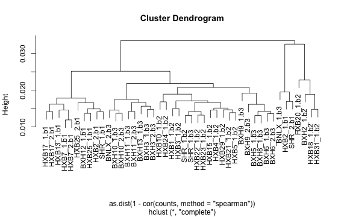

========================================================

Combine RSEM Values Across Batches
----------------------------------


```r
rm(list=ls())
options(stringsAsFactors=FALSE)
base.path = "/Volumes/saba/BxH.HxB.Rats/RNA-Seq/"

fileListing = read.table(file=paste(base.path,"data/fileListing.brain.26Jan15.txt",sep=""),sep="\t",header=TRUE)
fileListing$rsemName = paste(toupper(gsub(".b[1-9]","",fileListing$sampleName)),".b",fileListing$batch,sep="")
#rsemListing = read.table(file=paste(base.path,"data/fileListing.RSEM.txt",sep=""),sep="\t",header=FALSE)

sampleList=fileListing$rsemName

for(i in sampleList){
  y = read.table(file=paste(base.path,"quantitation/rsem.Ensembl/",i,".genes.results",sep=""),sep="\t",header=TRUE)
  y=y[,c("gene_id","expected_count")]
  colnames(y)[grep("count",colnames(y))]=paste(i,"cnt",sep=".")
  if(i==sampleList[1]) counts=y
  if(i!=sampleList[1]) counts=merge(counts,y,by=c("gene_id"))
  }

rownames(counts)=counts$gene_id
counts=counts[,grep("cnt",colnames(counts))]

## remove samples with less than 10 million aligned reads
counts=counts[,colSums(counts)>10000000]
colnames(counts)=gsub(".cnt","",colnames(counts),fixed=TRUE)
```


### Clustering of Raw Count Data
 

Definitely see some clustering by batch


```
## Loading required package: EDASeq
## Loading required package: Biobase
## Loading required package: BiocGenerics
## Loading required package: parallel
## 
## Attaching package: 'BiocGenerics'
## 
## The following objects are masked from 'package:parallel':
## 
##     clusterApply, clusterApplyLB, clusterCall, clusterEvalQ,
##     clusterExport, clusterMap, parApply, parCapply, parLapply,
##     parLapplyLB, parRapply, parSapply, parSapplyLB
## 
## The following object is masked from 'package:stats':
## 
##     xtabs
## 
## The following objects are masked from 'package:base':
## 
##     anyDuplicated, append, as.data.frame, as.vector, cbind,
##     colnames, do.call, duplicated, eval, evalq, Filter, Find, get,
##     intersect, is.unsorted, lapply, Map, mapply, match, mget,
##     order, paste, pmax, pmax.int, pmin, pmin.int, Position, rank,
##     rbind, Reduce, rep.int, rownames, sapply, setdiff, sort,
##     table, tapply, union, unique, unlist, unsplit
## 
## Welcome to Bioconductor
## 
##     Vignettes contain introductory material; view with
##     'browseVignettes()'. To cite Bioconductor, see
##     'citation("Biobase")', and for packages 'citation("pkgname")'.
## 
## Loading required package: ShortRead
## Loading required package: BiocParallel
## Loading required package: Biostrings
## Loading required package: S4Vectors
## Loading required package: stats4
## Loading required package: IRanges
## Loading required package: XVector
## Loading required package: Rsamtools
## Loading required package: GenomeInfoDb
## Loading required package: GenomicRanges
## Loading required package: GenomicAlignments
## Loading required package: edgeR
## Loading required package: limma
## 
## Attaching package: 'limma'
## 
## The following object is masked from 'package:BiocGenerics':
## 
##     plotMA
```


